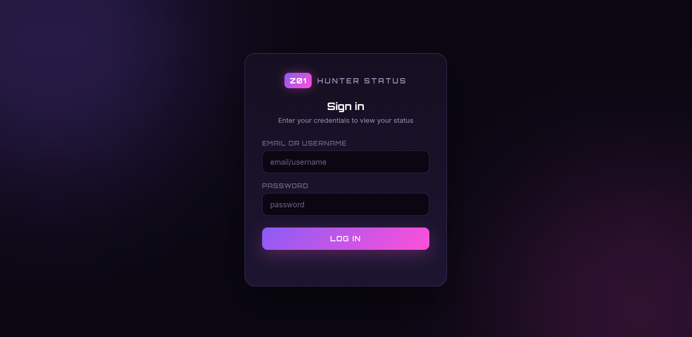
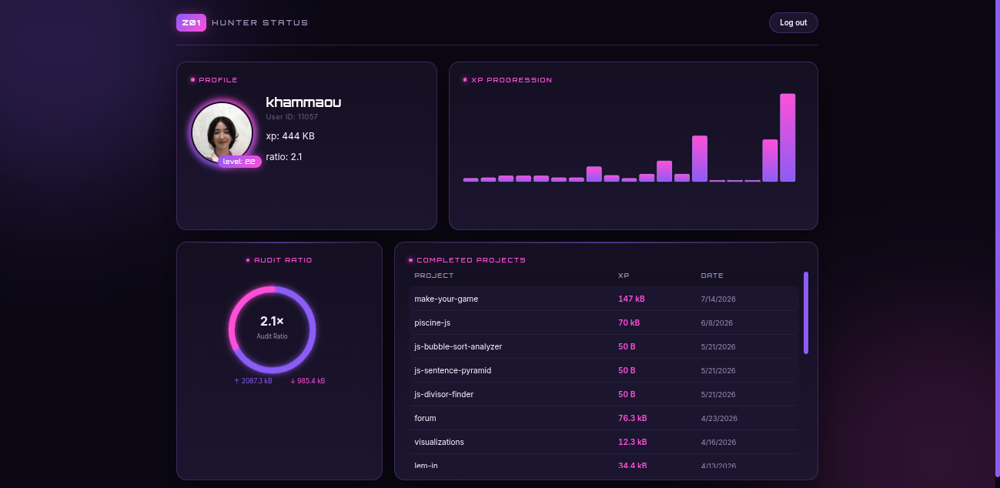

# GraphQL Profile


A personal school profile page for the **GraphQL** project at Zone01 Oujda. Logs in, queries the platform's GraphQL API for the authenticated user's own data, and displays it with SVG statistics.

**Live demo:** https://khammaou-graphql.netlify.app/

## Features

- Login with `username:password` or `email:password`, with error messages on invalid credentials, and a logout option
- Profile overview: avatar, login, ID, level, XP, and audit ratio
- List of completed projects with XP and date
- Two SVG statistic graphs:
  - 🟣 **XP progression** — bar chart of XP per project
  - 🩷 **Audit ratio** — donut chart of XP given vs. received, with graceful handling for accounts with no audits or no downs

## Screenshots

| Login | Profile |
|---|---|
|  |  |

## GraphQL

The main query combines all three required styles:
- **Normal** — basic `user` fields (`id`, `login`, `avatarUrl`, `auditRatio`, `totalUp`, `totalDown`)
- **Arguments** — `where` filters on `transaction`/`xps`, plus `order_by` + `limit` for the latest level
- **Nested** — `xps` nested inside `user`, and project fields nested inside each transaction

## Tech stack

Vanilla JavaScript (ES modules), native `fetch`, hand-written SVG charts, plain HTML/CSS — no frameworks or libraries.

## Project structure

```
.
├── index.html          # Login page
├── profile.html        # Profile / dashboard page
├── css/style.css        # Shared styling
└── js/
    ├── auth.js           # Signin request, JWT storage
    ├── login.js          # Login form handling
    ├── graphql.js        # Authenticated GraphQL fetch wrapper
    ├── profile.js         # Profile query + rendering
    └── charts.js          # SVG charts
```

## Running locally

Static site, no build step. Needs a local server for ES modules:

```bash
npx serve .
```

Hosted on [Netlify](https://www.netlify.com/).

## What I learned

Writing normal, argument-based, and nested GraphQL queries; JWT authentication (Basic to sign in, Bearer to query); building SVG charts from scratch; structuring a small vanilla JS app with ES modules.